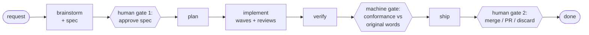

<p align="center">
  
</p>

# pi-gauntlet

[](https://buymeacoffee.com/jjurasszek)

The gated workflow for the [pi coding agent](https://github.com/earendil-works/pi): brainstorm, plan, implement, verify, ship - each stage a gate the next can't open until it closes.

## The problem

Point an agent at a task and let it loop until done - that's the easy 5%. A bare loop has nothing to aim at, nothing to stop it shipping the wrong thing, and no check that the final output matches what you actually asked for. It holds up on a narrow, well-specified task and drifts on anything open-ended: the agent reinterprets the ask as it goes, nobody catches it until review, and by then the diff is large enough that review is theater too.

That's not a model problem. Cursor, Claude Code, Codex, Devin all run some version of the same loop, and all of them drift the same way on long tasks - because nothing in the loop confronts the output against the *original* intent.

## Why pi-gauntlet exists

pi-gauntlet is the scaffolding that makes the loop hold: **brainstorm → plan → implement → verify → ship**. Gates between phases are automated checks, not signatures to collect - a multi-model spec critique, an adversarial code review, and a closing conformance check that confronts the finished diff **and docs** against your **original verbatim prompt**, not the plan that got derived from it. The agent can't wave itself through a gate, and you're not rubber-stamping each step by hand.

Human judgment is spent on the two decisions that need it - *what to build*, up front, and *how to land it*, at the end. The middle runs without pausing for you. The spec and docs get committed to the repo, so the next change starts from ground truth, not a blank slate.

## Part of the pi agent toolkit

Four independent extensions for the [pi coding agent](https://github.com/earendil-works/pi), each owning one concern of running agents seriously:

- [pi-quiver](https://github.com/jjuraszek/pi-quiver) - capabilities (ground-truth ingestion: fetch, doc conversion, session tools)
- [pi-cohort](https://github.com/jjuraszek/pi-cohort) - coordination (delegate to focused child agents)
- [pi-condense](https://github.com/jjuraszek/pi-condense) - context economy (prune context, keep it recoverable)
- **pi-gauntlet - process (this repo: the gated brainstorm→ship workflow)**

pi-gauntlet's only hard dependency is pi-cohort - every gate that dispatches a reviewer or an implementer does it through pi-cohort's `subagent()`. pi-condense is not required, but a long gated run generates a lot of tool output; pruning it as you go is what keeps that run affordable.

## What a run looks like

Concretely, one change through the gauntlet:

1. You describe the change. **`brainstorming`** sets up an isolated worktree, explores the codebase, and turns your description into a written spec. A multi-model critique runs on it automatically. **You read and approve the spec - human gate 1.** No implementation code exists yet.
2. **`writing-plans`** decomposes the approved spec into atomic, independently-verifiable tasks, grouped into parallel waves where they don't touch the same files.
3. **`subagent-driven-development`** executes the plan one task at a time, each in a fresh subagent, behind spec-compliance review then code-quality review. TDD-locked: red, green, refactor.
4. **verify**: a whole-diff code review, then the **conformance gate** - a subagent reads the finished code and docs against your *original words* from step 1, not the plan, and reports per-requirement: delivered, partial, missing, drifted, or unauthorized. This gate is machine-blocked from being skipped. Requirement-restoring gaps (code drifted from the approved spec) auto-close through an isolated fix-and-re-audit loop with no prompt; only decisions that would *rewrite* your approved spec - accept, rescope, or removing unrequested code - are deferred to the finishing gate for your call.
5. **`finishing-a-development-branch`**: squash, PR, keep, or discard. **Human gate 2** - the only other decision you make.



<!-- TODO GIF: a real gauntlet run end to end -->

Everything between gate 1 and gate 2 - task breakdown, implementation, both review passes - runs without you in the loop. That's the mechanism. What follows is the machinery behind it.

## Architecture

pi-gauntlet ships three kinds of pieces, layered on top of pi-cohort's dispatch:

- **13 skills** - the workflow logic. They activate automatically when pi sees the matching kind of task, and each one gates the next: `brainstorming`, `writing-plans`, `roasting-the-spec`, `test-driven-development`, `subagent-driven-development`, `dispatching-parallel-agents`, `verification-before-completion`, `systematic-debugging`, `requesting-code-review`, `receiving-code-review`, `using-git-worktrees`, `finishing-a-development-branch`, `writing-skills`.
- **7 subagent personas** - the specialized child agents the skills dispatch via pi-cohort: `implementer`, `code-reviewer`, `spec-reviewer`, `conformance-reviewer`, `spec-summarizer`, `spec-council-member`, `spec-council-synthesizer`. See [doc/personas.md](./doc/personas.md) for what each one does and why its permissions are scoped the way they are.
- **3 runtime extensions** - the enforcement layer. `plan-tracker` and `phase-tracker` are tools skills call to track progress (with a TUI widget); `verify-before-ship` is a hook that warns if you commit/push without a passing test run since your last edit. See [doc/configuration.md](./doc/configuration.md) for the settings each one reads.

pi-gauntlet is **opinionated**: every non-trivial change rides this one pipeline. There's no separate "just edit a file and commit" path - the skills gate each other, so the phase-tracker extension mechanically blocks a phase from closing before its gate runs. Reach for a shortcut and a gate stops you; that's the design, not friction.

## Key concepts

| Term | Meaning |
| --- | --- |
| Gate | A machine-enforced checkpoint between phases (e.g. `complete verify` is blocked until conformance review has run). Not a suggestion. |
| Spec council | Multi-model critique of the spec before you see it (`roasting-the-spec`); falls back to a single-model critique if no council is configured. |
| Conformance gate | The closing check: does the delivered code + docs match your *original prompt*, not the derived plan? Per-requirement verdict; auto-fixes requirement-restoring gaps, defers spec-rewriting decisions (accept/rescope/unauthorized) to the finishing gate. |
| Wave | A batch of plan tasks that don't touch the same files, dispatched to implementers in parallel. |
| Overrides file | `.pi/gauntlet-overrides.md` - where you put project-specific detail the generic skills don't know (CI command, worktree wrapper, routing rules). |

## When to use / when NOT to use

**Use it** for any change with more than one moving part: a feature, a refactor across files, anything where "what did we actually agree to build" matters by the time it's done.

**Don't use it** for a one-line fix, a typo, or a throwaway spike you're going to discard. The gates have real overhead - a spec, a plan, a conformance check - and that overhead isn't worth paying for a change trivial enough to just make.

## Requirements

- [pi-coding-agent](https://github.com/earendil-works/pi) ≥ 0.1.0
- [pi-cohort](https://github.com/jjuraszek/pi-cohort) ≥ 1.4.5 - required peer package. Skills that dispatch agents (`requesting-code-review`, `subagent-driven-development`, `dispatching-parallel-agents`, `writing-plans`, `writing-skills`) call `subagent({})`, which pi-cohort provides. pi-gauntlet does not vendor the dispatch tool; without pi-cohort those skills have nothing to call.

Both packages must be listed in your `.pi/settings.json#packages` array (pi adds them automatically when you `pi install`). pi-gauntlet and pi-cohort are versioned independently but release together whenever dispatch semantics change - pin compatible versions of both.

## Install

**Project scope** (recommended - committable via the repo's `.pi/settings.json`; `-l` writes to project settings):

```bash
pi install -l npm:pi-cohort
pi install -l npm:pi-gauntlet
```

**User scope** (all repos under your pi profile; the default target is user settings):

```bash
pi install npm:pi-cohort
pi install npm:pi-gauntlet
```

Pin an exact release with `npm:pi-gauntlet@X.Y.Z`. See [doc/install-internals.md](./doc/install-internals.md) for what the postinstall step actually does (symlink vs copy, `PI_GAUNTLET_AGENT_DIR`, upgrading from the pre-rename package).

For local development against a checkout instead of npm:

```bash
git clone git@github.com:jjuraszek/pi-gauntlet.git ~/repos/pi-gauntlet
cd ~/path/to/your/repo && pi install -l ~/repos/pi-gauntlet
cd ~/repos/pi-gauntlet && npm run link-agents   # local-path installs skip npm install; run this once
```

## Project-specific overrides

The skills shipped here are generic on purpose - they describe *how* to TDD, brainstorm, debug, request review, etc., without naming your services, your CI command, or your worktree wrapper. When you need that level of detail, drop a file at `.pi/gauntlet-overrides.md` in your repo. The skills read it at runtime and merge sections that match the skill's name or topic:

```markdown
## verification-before-completion

Canonical verification target: `make ci` per service. Bare `pytest` does NOT satisfy
the gate — it skips integration tests.

## using-git-worktrees

Use the project's wrapper: `script/worktree create <name>`. It provisions an isolated
database and copies `.env.local`. Never call `git worktree add` directly.
```

Section headers should match skill names (`## verification-before-completion`) or skill topics (`## worktrees`, `## routing`). The override file is read by the skill instructions at runtime, not by the pi runtime itself, so adding a section only matters once the matching skill is active.

## Configuring the gates

The conformance gate's model, the spec council's roster, and the phase-tracker's flow guards are all configured per pi preset (or per repo, via `.pi/settings.json`). See [doc/configuration.md](./doc/configuration.md) for every setting, its default, and how repo-local config overrides a preset.

## Relationship to the other repos

pi-gauntlet is the process layer: it enforces the workflow, but every reviewer and implementer it dispatches runs through [pi-cohort](https://github.com/jjuraszek/pi-cohort)'s `subagent()` - that's a hard dependency, not an integration you can skip. [pi-condense](https://github.com/jjuraszek/pi-condense) is optional but keeps a long gated run's context (and cost) from growing unbounded across all those dispatches. [pi-quiver](https://github.com/jjuraszek/pi-quiver) is complementary - if a brainstorm or implementation step needs to pull in a real doc or web page, that's what ingests it safely.

## Roadmap

Nothing committed beyond what's shipped. Changes land via [CHANGELOG.md](./CHANGELOG.md).

## Lineage

pi-gauntlet's skill methodology was inspired by [obra/superpowers](https://github.com/obra/superpowers) (MIT, Copyright (c) 2025 Jesse Vincent), by way of [coctostan/pi-superpowers-plus](https://github.com/coctostan/pi-superpowers-plus). The pi runtime integration, enforced phase gates, multi-model spec council, conformance-review gate, and parallel execution waves are pi-gauntlet's own. Thanks to the upstream authors; their copyright is preserved in [`LICENSE`](./LICENSE).

## Support

[Buy me a coffee](https://buymeacoffee.com/jjurasszek) if this saves you time.

## License

MIT. See [`LICENSE`](./LICENSE). Portions derive from obra/superpowers (MIT) and coctostan/pi-superpowers-plus; their copyright notice is preserved in `LICENSE`.
