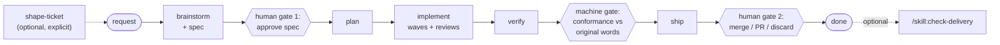

<p align="center">
  
</p>

# pi-gauntlet

[](https://buymeacoffee.com/jjurasszek)

The gated workflow for the [pi coding agent](https://github.com/earendil-works/pi): brainstorm, plan, implement, verify, ship - each stage a gate the next can't open until it closes.

## The problem

Point an agent at a task and let it loop until done - that's the easy 5%. A bare loop has nothing to aim at, nothing to stop it shipping the wrong thing, and no check that the final output matches what you actually asked for. It holds up on a narrow, well-specified task and drifts on anything open-ended: the agent reinterprets the ask as it goes, nobody catches it until review, and by then the diff is large enough that review is theater too.

That's not a model problem. Cursor, Claude Code, Codex, Devin all run some version of the same loop, and all of them drift the same way on long tasks - because nothing in the loop confronts the output against the *original* intent.

## Why pi-gauntlet exists

pi-gauntlet is the scaffolding that makes the loop hold: **brainstorm → plan → implement → verify → ship**. Gates between phases are automated checks, not signatures to collect - a multi-model spec critique, an adversarial code review, and a closing conformance check that confronts the finished diff **and docs** against your **original verbatim prompt**, not the plan that got derived from it. The agent can't wave itself through a gate, and you're not rubber-stamping each step by hand.

Human judgment is spent on the two decisions that need it - *what to build*, up front, and *how to land it*, at the end. The middle runs without pausing for you. The spec and docs get committed to the repo, so the next change starts from ground truth, not a blank slate.

## Part of the pi agent toolkit

Four independent extensions for the [pi coding agent](https://github.com/earendil-works/pi), each owning one concern of running agents seriously:

- [pi-quiver](https://github.com/jjuraszek/pi-quiver) - capabilities (ground-truth ingestion: fetch, doc conversion, session tools)
- [pi-cohort](https://github.com/jjuraszek/pi-cohort) - coordination (delegate to focused child agents)
- [pi-condense](https://github.com/jjuraszek/pi-condense) - context economy (prune context, keep it recoverable)
- **pi-gauntlet - process (this repo: the gated brainstorm→ship workflow)**

pi-gauntlet's only hard dependency is pi-cohort - every gate that dispatches a reviewer or an implementer does it through pi-cohort's `subagent()`. pi-condense is not required, but a long gated run generates a lot of tool output; pruning it as you go is what keeps that run affordable.

## What a run looks like

Concretely, one change through the gauntlet:

0. *(Optional)* Before there's even a spec, `/skill:shape-ticket` can create or repair a single tracker issue - shaping a raw ask into a Context/Problem/Idea/Acceptance Criteria ticket, gated by an AC integrity check, a cheap council roast, and one human-confirmed write that may include one optional gated Reporter-note comment. A failed roast is retried once, then surfaced inline at the gate if it fails again. It's a tool, not a phase: no worktree, no plan/phase tracker, runs from any repo state. It never activates on its own (`disable-model-invocation: true`) - invoke it explicitly.
1. You describe the change. **`brainstorming`** sets up an isolated worktree, explores the codebase, and turns your description into a written spec. A multi-model critique runs on it automatically. If the spec replaces a known prior spec, brainstorming marks the predecessor with a `> **Superseded by:**` banner under its title (default format, syntax overridable via `.pi/gauntlet-overrides.md`; event-driven only — gauntlet never sweeps historical specs). **You read and approve the spec - human gate 1.** No implementation code exists yet.
2. **`writing-plans`** decomposes the approved spec into atomic, independently-verifiable tasks, grouped into parallel waves where they don't touch the same files.
3. **`subagent-driven-development`** executes the plan one task at a time, each in a fresh subagent, behind spec-compliance review then code-quality review. TDD-locked: red, green, refactor.
4. **verify**: a whole-diff code review, then the **conformance gate** - a subagent reads the finished code and docs against your *original words* from step 1, not the plan, and reports per-requirement: delivered, partial, missing, drifted, or unauthorized. Inside a brainstorming-entered flow this gate is machine-blocked from being skipped. Compatible executable recommendations auto-run through an isolated fix-and-re-audit loop with no prompt; anything still open surfaces as a dense list - one line per decision, plain-language, with its recommended choice inline. Reply `1` to take every recommendation, or `2:` with per-item overrides; a current `CONFORMS` / no-concerns result goes straight to the branch options with no extra conformance sign-off.
5. **`finishing-a-development-branch`**: squash, PR, keep, or discard. Once a PR exists, run `/skill:gatekeep-pr <pr>` to verify it against its issue before merging. **Human gate 2** - the only other decision you make.
6. *(Optional)* Once the merge lands, `/skill:check-delivery <ref>` can prove delivery - default-branch landing, delivery target, per-AC evidence - before the tracker status advances. Explicit invocation only, no auto-chain: deploys commonly lag merges by minutes to hours, so an auto-run would routinely check too early.

Only the machine-owned `plan -> implement` and `verify -> ship` handoffs receive a branch-local one-shot nudge after an unexpected settled stop; it is fire-and-forget, does not bypass either human gate, and older Pi hosts without `agent_settled` retain existing behavior.


```mermaid
flowchart LR
    T["shape-ticket<br/>(optional, explicit)"]
    R([request]) --> B[brainstorm<br/>+ spec]
    T -.-> R
    B --> G1{{human gate 1:<br/>approve spec}}
    G1 --> P[plan]
    P --> I[implement<br/>waves + reviews]
    I --> V[verify]
    V --> M{{machine gate:<br/>conformance vs<br/>original words}}
    M --> S[ship]
    S --> G2{{human gate 2:<br/>merge / PR / discard}}
    G2 --> D([done])
    D -.optional.-> CD["/skill:check-delivery"]
```

<!-- TODO GIF: a real gauntlet run end to end -->

Everything between gate 1 and gate 2 - task breakdown, implementation, both review passes - runs without you in the loop. That's the mechanism. What follows is the machinery behind it.

## Architecture

pi-gauntlet ships three kinds of pieces, layered on top of pi-cohort's dispatch:

- **16 skills** - the workflow logic. Thirteen activate automatically when pi sees the matching kind of task, and each one gates the next: `brainstorming`, `writing-plans`, `roasting-the-spec`, `test-driven-development`, `subagent-driven-development`, `dispatching-parallel-agents`, `verification-before-completion`, `systematic-debugging`, `requesting-code-review`, `receiving-code-review`, `using-git-worktrees`, `finishing-a-development-branch`, `writing-skills`. Three more are explicit-invocation-only (`disable-model-invocation: true`): `shape-ticket` creates or repairs one tracker issue per run against a Context/Problem/Idea/Acceptance-Criteria template, gated by an AC integrity check, a cheap council roast, and a single human-confirmed write - run it with `/skill:shape-ticket`. `gatekeep-pr` is consent-gated pre-merge verification of a PR against its issue - read-only gathering, running the project's verification command, a rubric-based review, then a deterministic authorship-aware menu with stable finding IDs (P#/L#/C#/F#) and numbered pre-composed courses (fixes execute as a single parallel-safe wave: one gate run, one re-review, one push); nothing mutates (fixes, pushes, reviews, merges) until you pick a row - run it with `/skill:gatekeep-pr <pr>`. `check-delivery` is a post-merge detective control: proves an issue actually shipped (default-branch landing, delivery target, per-AC evidence) before its tracker status advances; it never writes a terminal status - run it with `/skill:check-delivery <ref>`.
- **7 subagent personas** - the specialized child agents the skills dispatch via pi-cohort: `implementer`, `code-reviewer`, `spec-reviewer`, `conformance-reviewer`, `spec-summarizer`, `spec-council-member`, `spec-council-synthesizer`. See [doc/personas.md](./doc/personas.md) for what each one does and why its permissions are scoped the way they are.
- **3 runtime extensions** - the enforcement layer. `plan-tracker` and `phase-tracker` are tools skills call to track progress (with a TUI widget); `verify-before-ship` is a hook that warns if you push or open a PR without a passing test run since your last edit; a phase-tracker flow guard reminds on implement-phase commits missing spec/code review. See [doc/configuration.md](./doc/configuration.md) for the settings each one reads.

pi-gauntlet is **opinionated**: every non-trivial change is *meant* to ride this one pipeline, entered through `brainstorming`. Enforcement is opt-in by entry, not ambient: once brainstorming starts a flow, the phase-tracker extension mechanically blocks a phase from closing before its gate runs, and warns once if the main loop writes code during implement (subagents own implement-phase edits). A change made *without* entering the flow (a typo, a formatting run, a dependency bump - see "When to use / when NOT to use") is not gated; the discipline of routing real work through the pipeline is a convention the tooling supports, not a trap it springs on every edit.

## Key concepts

| Term | Meaning |
| --- | --- |
| Gate | A machine-enforced checkpoint between phases (e.g. within a brainstorming-entered flow, `complete verify` is blocked until conformance review has run). Not a suggestion. |
| Spec council | Multi-model critique of the spec before you see it (`roasting-the-spec`); falls back to a single-model critique if no council is configured. |
| Conformance gate | The closing check: does the delivered code + docs match your *original prompt*, not the derived plan? Compatible executable recommendations auto-fix first; anything still open renders as a dense one-line-per-decision list with each recommended choice inline. Reply `1` to accept all recommendations or `2:` with per-item overrides; a current `CONFORMS` / no-concerns handoff goes straight to branch options with no extra sign-off. |
| Wave | A batch of plan tasks that don't touch the same files, dispatched to implementers in parallel. |
| Overrides file | `.pi/gauntlet-overrides.md` - where you put project-specific detail the generic skills don't know (CI command, worktree wrapper, routing rules). |

## When to use / when NOT to use

**Use it** for any change with more than one moving part: a feature, a refactor across files, anything where "what did we actually agree to build" matters by the time it's done.

**Don't use it** for a one-line fix, a typo, or a throwaway spike you're going to discard. The gates have real overhead - a spec, a plan, a conformance check - and that overhead isn't worth paying for a change trivial enough to just make.

## Requirements

- [pi-coding-agent](https://github.com/earendil-works/pi) ≥ 0.1.0
- [pi-cohort](https://github.com/jjuraszek/pi-cohort) ≥ 1.4.5 - required peer package. Skills that dispatch agents (`requesting-code-review`, `subagent-driven-development`, `dispatching-parallel-agents`, `writing-plans`, `writing-skills`, `shape-ticket`, `roasting-the-spec`) call `subagent({})`, which pi-cohort provides. pi-gauntlet does not vendor the dispatch tool; without pi-cohort those skills have nothing to call.

Both packages must be listed in your `.pi/settings.json#packages` array (pi adds them automatically when you `pi install`). pi-gauntlet and pi-cohort are versioned independently but release together whenever dispatch semantics change - pin compatible versions of both.

## Install

**Project scope** (recommended - committable via the repo's `.pi/settings.json`; `-l` writes to project settings):

```bash
pi install -l npm:pi-cohort
pi install -l npm:pi-gauntlet
```

**User scope** (all repos under your pi profile; the default target is user settings):

```bash
pi install npm:pi-cohort
pi install npm:pi-gauntlet
```

Pin an exact release with `npm:pi-gauntlet@X.Y.Z`. See [doc/install-internals.md](./doc/install-internals.md) for what the postinstall step actually does (symlink vs copy, `PI_GAUNTLET_AGENT_DIR`, upgrading from the pre-rename package).

For local development against a checkout instead of npm:

```bash
git clone git@github.com:jjuraszek/pi-gauntlet.git ~/repos/pi-gauntlet
cd ~/path/to/your/repo && pi install -l ~/repos/pi-gauntlet
cd ~/repos/pi-gauntlet && npm run link-agents   # local-path installs skip npm install; run this once
```

## Use from Claude Code

Three skills are exposed to Claude Code via the plugin marketplace at
`.claude-plugin/marketplace.json`: **shape-ticket**, **gatekeep-pr**, and
**check-delivery**. They are harness-portable by design - every pi-specific
mechanic they touch (`plan_tracker`, `gauntlet_setting`, `subagent()`) carries
an inline fallback, so they run on Claude Code's native facilities. This is the
supported set. Not exposed, in two classes: (a) genuinely pi-bound surface -
the full gated pipeline (brainstorming -> writing-plans ->
subagent-driven-development -> verify -> finish), the spec council, the
conformance gate, flow guards, verify-before-ship, and all `piGauntlet.*`
settings, which depend on pi extensions; (b) runtime-neutral skills
(e.g. `systematic-debugging`, `receiving-code-review`, `using-git-worktrees`) that
are simply out of scope for this channel, not incompatible - re-adding one is a
one-line allowlist append. For Claude-Code-native equivalents of the
methodology skills, see [obra/superpowers](https://github.com/obra/superpowers).

### Setup

Add to your repo's `.claude/settings.json`:

```json
{
  "extraKnownMarketplaces": {
    "pi-gauntlet": {
      "source": { "source": "github", "repo": "jjuraszek/pi-gauntlet" }
    }
  },
  "enabledPlugins": { "gauntlet@pi-gauntlet": true }
}
```

Add `"ref": "vX.Y.Z"` to the source object to pin a tag; the default tracks the
default branch. Claude Code merges settings entries whole (no field-level
merge), so teams layering managed settings must carry the full objects.

Registration, installation, and enablement are distinct steps in Claude Code:
`extraKnownMarketplaces` registers the marketplace, `enabledPlugins` records
enablement intent. If a fresh machine shows the plugin as known but not
installed, run `/plugin install gauntlet@pi-gauntlet` once. Alternative path
without touching settings.json: `/plugin marketplace add jjuraszek/pi-gauntlet`,
then install.

Invocation: `/gauntlet:shape-ticket` (or bare `/shape-ticket` when unambiguous).

Project instructions: Claude Code reads `CLAUDE.md`, pi reads `AGENTS.md` - a
symlink keeps one source of truth: `ln -s AGENTS.md CLAUDE.md`. The gauntlet
overrides ladder (`.pi/gauntlet-overrides.md` -> `gauntlet-overrides.md` ->
`doc/gauntlet-overrides.md`) works unchanged on Claude Code - it is a plain
file read.

**Trust gotcha:** the marketplace auto-activates only after you trust *that
exact repo folder* in interactive Claude Code. Trusting a parent folder,
`claude -p`, or SDK runs in untrusted folders silently skip
`extraKnownMarketplaces` with no error.

### Smoke test

1. Create a scratch repo and add the marketplace config:

       mkdir -p /tmp/cc-smoke/.claude && cd /tmp/cc-smoke && git init
       cat > .claude/settings.json <<'EOF'
       {
         "extraKnownMarketplaces": {
           "pi-gauntlet": {
             "source": { "source": "github", "repo": "jjuraszek/pi-gauntlet" }
           }
         },
         "enabledPlugins": { "gauntlet@pi-gauntlet": true }
       }
       EOF

2. Start Claude Code interactively in that directory: `claude`
3. When prompted, trust the folder (this exact folder - trust is what activates
   the marketplace; there is no separate marketplace prompt).
4. Run `/plugin` and confirm: marketplace `pi-gauntlet` is listed, plugin
   `gauntlet` is enabled. If it shows as known but not installed, run
   `/plugin install gauntlet@pi-gauntlet` and re-check.
5. Confirm exactly three skills are registered under the plugin (via the
   `/plugin` details view): shape-ticket, gatekeep-pr, check-delivery.
6. Invoke `/gauntlet:shape-ticket` with a deliberately two-concern ask (e.g.
   "shape a ticket: CSV import for operators, plus a partner-facing status
   API") so the skill deterministically consults its
   `reference/split-axes.md` before proposing a split. Expected: skill
   activates, reads the reference file, reaches its tracker capability ladder
   without erroring on missing pi tools. Stop at the first human gate; write
   nothing to any tracker.
7. Invoke `/gauntlet:gatekeep-pr` in the scratch repo (which has no PR).
   Expected: the skill activates and stops at its configuration/verification
   ladder reporting nothing to gate - no error about missing pi tools, no
   mutation.
8. Invoke `/gauntlet:check-delivery` with no deliverable reference. Expected:
   the skill activates and asks for / reports a missing deliverable set - a
   reported skip, not a pass, and no pi-tool error.
9. Negative check: type `/gauntlet:brainstorming`. Expected: no such skill -
   the allowlist excluded it.
10. Optional validator pass: `claude plugin validate .` from a checkout of
    pi-gauntlet (strict mode if available). Expected: no schema errors.
11. Agent check: type `@gauntlet:` in the mention typeahead (or open the
    plugin's details). Expected: the plugin registers no agents - `"agents": []`
    in the marketplace entry suppresses the default `agents/` scan of the
    repo's pi personas.

## Project-specific overrides

The skills shipped here are generic on purpose - they describe *how* to TDD, brainstorm, debug, request review, etc., without naming your services, your CI command, or your worktree wrapper. When you need that level of detail, drop a file at `.pi/gauntlet-overrides.md` in your repo. The skills read it at runtime and merge sections that match the skill's name or topic:

```markdown
## verification-before-completion

Canonical verification target: `make ci` per service. Bare `pytest` does NOT satisfy
the gate — it skips integration tests.

## using-git-worktrees

Use the project's wrapper: `script/worktree create <name>`. It provisions an isolated
database and copies `.env.local`. Never call `git worktree add` directly.
```

Section headers should match skill names (`## verification-before-completion`) or skill topics (`## worktrees`, `## routing`). The override file is read by the skill instructions at runtime, not by the pi runtime itself, so adding a section only matters once the matching skill is active.

**Discovery ladder:** skills check three locations, in order, and use the first one found - never merged: `.pi/gauntlet-overrides.md`, then `<repo root>/gauntlet-overrides.md`, then `<repo root>/doc/gauntlet-overrides.md` (`<repo root>` = `git rev-parse --show-toplevel`, or the current directory outside a repo). Pick one location per repo.

**`## Issue tracker` section:** `shape-ticket` resolves tracker access through a capability ladder, and this is its first rung - it overrides the zero-config `gh` (GitHub) / `linearis` (Linear) defaults for any other tracker. Name the CLI's read, search, create, update, and post comment commands explicitly. For a Jira CLI, for example:

```markdown
## Issue tracker

Use the `jira` CLI (authenticated via `jira login`), not `gh` or `linearis`.

- read (full, incl. comments): `jira issue view ABC-123 --comments`
- search (dup/reversal check): `jira issue search --jql "project = ABC AND text ~ '<query>'"`
- create: `jira issue create --project ABC --type Task --summary "<title>" --description "<body>"`
- update: `jira issue edit ABC-123 --summary "<title>" --description "<body>"`
- post comment (Reporter note only): `jira issue comment ABC-123 --body "<text>"`
```

**`## Deployment` section:** `shape-ticket` (split rule), `writing-plans` (scope check), and `brainstorming` (scope check) read deploy topology from this section: what ships together, what ships independently, and the mechanism. It is a fact to look up, never to infer - when the section is absent, or when it documents a monolithic topology (like the example below), the "separable release timing" split axis is unavailable and splits fail closed to one artifact.

```markdown
## Deployment

One deploy workflow ships the whole system at once - nothing ships independently.
```

**`## Delivery` section:** `check-delivery` resolves its overrides through the same discovery ladder. Defaults are pessimistic where it matters: an unset `target state` keeps the write comment-only; unset `deploy watch`/`delivery target` skip stage 2 (reported, never silently passed); `browser evidence` defaults to never. `check-delivery` is single-ticket by design - sweep/reconciliation passes over many tickets stay consumer territory, invoking the skill once per ticket. The remaining slots have working defaults shown below:

| Slot | Meaning | Default (unset) |
|---|---|---|
| `target state` | Non-terminal tracker state to advance to on success | none - comment only |
| `deploy watch` | Workflow/command to await before the target check | none |
| `delivery target` | URL / health endpoint / registry query / command + success predicate reflecting the shipped SHA (`<sha>` substituted) | none - stage 2 skipped, reported |
| `timeout` | Upper bound on stage 2 (watch + target check) | 10 minutes when stage 2 runs at all |
| `browser evidence` | When/how to capture UI evidence (requires a browser tool) | never |
| `ref convention` | How commits/PRs reference tickets (e.g. `(ref ABC-123)`) | tracker-native forms (`#N`, `Fixes #N`, bare `ABC-123`) |
| `AC location` | Where ACs live if not the ticket body | ticket body |
| `synthesized AC gaps` | `block` or `soft` - whether an unmet synthesized AC produces a blocking `unexplained gap` or a non-blocking proposal | `soft` |
| `descope edits` | `strikethrough` - on gate approval, strike ratified `proposed descope` AC lines in the ticket body | none - no body edits ever |

Malformed slot values fail safe, with one warning per invocation naming the
bad value: `synthesized AC gaps` treats anything other than `block`/`soft`
as `soft`; `descope edits` treats anything other than `strikethrough` as
unset (no body edits). `descope edits` also requires a resolved edit-body
write verb: when the slot is active and the approval ratifies a `proposed
descope` but no edit-body verb resolves, the whole batched write (body
edit, evidence comment, status advance) degrades to manual - none
auto-posted.

```markdown
## Delivery
- target state: Ready
- deploy watch: gh run watch --workflow deploy.yml (run for <sha>)
- delivery target: curl -fsS https://staging.example.com/version | grep <sha>
- timeout: 15m
- ref convention: (ref ABC-123)
- synthesized AC gaps: block
- descope edits: strikethrough
```

## REVIEW.md convention

`/skill:gatekeep-pr` (the pre-merge gate) reads an optional root-level `REVIEW.md` -
discovered at the repo root only, read from the PR's base (never the PR's own head,
so a PR can't weaken the rubric that gates it). It's a plain data file, not agent
instructions: a rubric other tooling can read too. The skill is fully functional with
no `REVIEW.md` present - it falls back to the shipped baseline rubric
(`skills/gatekeep-pr/review-baseline.md`).

**Overlay precedence**, first match wins on any conflict:

1. Repo root `REVIEW.md` - always wins over everything below it.
2. Shipped `skills/gatekeep-pr/review-baseline.md` - the generic default rubric.
3. Reviewer-persona defaults.

A `REVIEW.md` entry that names a baseline concern (e.g. a severity mapping) replaces
it; everything it doesn't name stays baseline. Severities it introduces but doesn't
map to blocking/non-blocking are treated as **blocking** (fail-safe), noted in the
gate's output.

`REVIEW.md` is a diff over the baseline, not a full rewrite. Starter template:

```markdown
# REVIEW.md

Severity mapping: Critical and Moderate findings block merge; Minor is a
non-blocking follow-up. Migration-safety findings also block merge.

Project checks (in addition to the baseline):
- Schema migrations are additive and reversible - no destructive column drops
  without a documented backfill/rollback plan.
- New background jobs declare an explicit retry/backoff policy - unbounded
  retries block merge.

Everything else follows the shipped baseline rubric.
```

## Thin-wrapper contract

A consumer repo that wants its own trigger phrases for the pre-merge gate (e.g. "gate
 this PR", "ready to merge?") adds a wrapper skill that carries **zero data** - only a
name, its trigger phrases, and an instruction to follow `/skill:gatekeep-pr`. All
customization lives in two places, never in the wrapper itself:

- **`REVIEW.md`** - the review rubric (see above).
- **The gauntlet overrides file, `## PR gate` section** - everything operational:

```markdown
## PR gate
- verification command: <command>            # required unless documented elsewhere
- timeout minutes: 15                        # optional; default 15
- requires credentials: false                # optional; true => skill reports "not run" as missing evidence
- worktree wrapper: <command>                # optional
- issue fetch: <command with <ref> placeholder>   # optional, replaces gh issue view
- merge policy: squash | merge-commit        # optional
```

An existing `## verification-before-completion` overrides section is an accepted
equivalent source for the verification command only; all other PR-gate keys
still live under `## PR gate`. A `## comms style` section in the same overrides
file extends gatekeep-pr's output done-check (rules applied to review bodies,
replies, tracker comments, and commit subjects before posting).

Anything a wrapper skill contains beyond trigger phrases is misplaced - move it to
`REVIEW.md` or the overrides file instead.

## Configuring the gates

The conformance gate's model, the spec council's roster, and the phase-tracker's flow guards are all configured per pi preset (or per repo, via `.pi/settings.json`). See [doc/configuration.md](./doc/configuration.md) for every setting, its default, and how repo-local config overrides a preset.

## Relationship to the other repos

pi-gauntlet is the process layer: it enforces the workflow, but every reviewer and implementer it dispatches runs through [pi-cohort](https://github.com/jjuraszek/pi-cohort)'s `subagent()` - that's a hard dependency, not an integration you can skip. [pi-condense](https://github.com/jjuraszek/pi-condense) is optional but keeps a long gated run's context (and cost) from growing unbounded across all those dispatches. [pi-quiver](https://github.com/jjuraszek/pi-quiver) is complementary - if a brainstorm or implementation step needs to pull in a real doc or web page, that's what ingests it safely.

## Roadmap

Nothing committed beyond what's shipped. Changes land via [CHANGELOG.md](./CHANGELOG.md).

## Lineage

pi-gauntlet's skill methodology was inspired by [obra/superpowers](https://github.com/obra/superpowers) (MIT, Copyright (c) 2025 Jesse Vincent), by way of [coctostan/pi-superpowers-plus](https://github.com/coctostan/pi-superpowers-plus). The pi runtime integration, enforced phase gates, multi-model spec council, conformance-review gate, and parallel execution waves are pi-gauntlet's own. Thanks to the upstream authors; their copyright is preserved in [`LICENSE`](./LICENSE).

## Contributing

See [CONTRIBUTING.md](CONTRIBUTING.md) - issues follow a Context / Problem / Idea / Acceptance Criteria template; PRs run the pi-gauntlet workflow (one-liners exempt from ceremony, never from keeping docs truthful).

## Support

[Buy me a coffee](https://buymeacoffee.com/jjurasszek) if this saves you time.

## License

MIT. See [`LICENSE`](./LICENSE). Portions derive from obra/superpowers (MIT) and coctostan/pi-superpowers-plus; their copyright notice is preserved in `LICENSE`.
