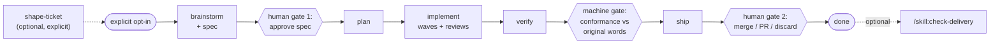

<p align="center">
  
</p>

# pi-gauntlet

[](https://buymeacoffee.com/jjurasszek)

The gated workflow for the [pi coding agent](https://github.com/earendil-works/pi): brainstorm, plan, implement, verify, ship - each stage a gate the next can't open until it closes.

## The problem

Point an agent at a task and let it loop until done - that's the easy 5%. LLMs are more a compressed library with a sampler on top than an independent mind: they produce fluent analysis faster than humans can audit it, and humans can't efficiently unravel that flood of output from the authenticity of a sound idea. So the agent quietly drifts from what you asked, and by the time you look, the diff is too big to honestly review.

It *is* a model problem - one-shotting an idea makes a great demo, not a product. But no better model fixes it on its own: Cursor, Claude Code, and Codex all drift the same way on long tasks, because nothing in a bare loop confronts output against *original* intent, and a model cannot audit itself - the same blind spot that wrote the bug will happily approve it. A weak generator needs a strong harness - because fluency is not correctness.

## Why pi-gauntlet exists

pi-gauntlet is the scaffolding that makes the loop hold: **brainstorm → plan → implement → verify → ship**. Gates between phases are automated checks, not signatures to collect - a multi-model spec critique, an adversarial code review, and a closing conformance check that confronts the finished diff **and docs** against your **original verbatim prompt**, not the plan that got derived from it. The agent can't wave itself through a gate, and you're not rubber-stamping each step by hand.

Human judgment is spent on the two decisions that need it - *what to build*, up front, and *how to land it*, at the end. The middle runs without pausing for you. The spec and docs get committed to the repo, so the next change starts from ground truth, not a blank slate.

## Part of the pi agent toolkit

Four independent extensions for the [pi coding agent](https://github.com/earendil-works/pi), each owning one concern of running agents seriously:

- [pi-quiver](https://github.com/jjuraszek/pi-quiver) - capabilities (ground-truth ingestion: fetch, doc conversion, session tools)
- [pi-cohort](https://github.com/jjuraszek/pi-cohort) - coordination (delegate to focused child agents)
- [pi-condense](https://github.com/jjuraszek/pi-condense) - context economy (prune context, keep it recoverable)
- **pi-gauntlet - process (this repo: the gated brainstorm→ship workflow)**

pi-gauntlet's only hard dependency is pi-cohort - every gate that dispatches a reviewer or an implementer does it through pi-cohort's `subagent()`. pi-condense is not required, but a long gated run generates a lot of tool output; pruning it as you go is what keeps that run affordable.

## What a run looks like

Concretely, one change through the gauntlet:

0. *(Optional)* Before there's even a spec, `/skill:shape-ticket` can create or repair a single tracker issue - shaping a raw ask into a Context/Problem/Idea/Acceptance Criteria ticket, gated by an AC integrity check, a cheap council roast, and one human-confirmed write that may include one optional gated Reporter-note comment. A failed roast is retried once, then surfaced inline at the gate if it fails again. It's a tool, not a phase: no worktree, no plan/phase tracker, runs from any repo state. It never activates on its own (`disable-model-invocation: true`) - invoke it explicitly. Similarly, `/skill:chase-bug` triages a raw bug report into an evidenced verdict - and can hand off to shape-ticket, brainstorming, or a bounded hotfix - before any spec exists.
1. Opt in with `/skill:brainstorming` and describe the change. The command is the reliable discovery-and-entry path; explicit prose requesting brainstorming/the gauntlet also supplies consent when the skill is already loaded or an available instruction or route identifies it. An ordinary implementation request or an agent recommendation is not consent. **`brainstorming`** sets up an isolated worktree, explores the codebase, and turns your description into a written spec - when its recon finds a cited case that the ask is the wrong change (misdiagnosed, wrong-sized, already solved, a band-aid, or cutting across a sound pattern - including a repo convention that is itself debt) and can name the alternative, question one is a framing question (`as framed`, `pivot: <alternative>`, or `smaller or none`); otherwise it opens with one sentence naming what it checked, and every approach it proposes ends with a `Pattern:` line naming what it follows or cuts across; when the run starts from a ticket, the spec carries the ticket's acceptance criteria verbatim, each with a disposition (`in-scope`, `deviates:`, `deferred:`, `venue:`), the conformance gate checks the in-scope ones, and `/skill:check-delivery` verifies `venue:` rows after deploy. A multi-model critique runs on it automatically. If the spec replaces a known prior spec, brainstorming marks the predecessor with a `> **Superseded by:**` banner under its title (default format, syntax overridable via `.pi/gauntlet-overrides.md`; candidates come from brainstorming's scout recon, never a mechanical sweep). **You read and approve the spec - human gate 1.** No implementation code exists yet.
2. **`writing-plans`** decomposes the approved spec into atomic, independently-verifiable tasks, grouped into parallel waves where they don't touch the same files.
3. **`subagent-driven-development`** executes the plan one task at a time, each in a fresh subagent, behind spec-compliance review then code-quality review. TDD-locked: red, green, refactor. Independent implementation, review, and council batches remain parallel, but their dispatches are foreground: the orchestrator waits for terminal results before accepting work or advancing a phase.
4. **verify**: the parent first runs the plan's full verification command set; only a passing result permits whole-diff code review, then the **conformance gate**. A review fix invalidates that result, so the parent reruns full verification before the next review or conformance gate. When the overrides file declares a happy path for the touched paths (see [Project-specific overrides](#project-specific-overrides)), the parent runs it once here, between code review and the conformance gate, and the reviewer reads its transcript as runtime evidence - a hang or a failed request shows up in the audit with the transcript quoted - as a gap when an origin clause ties to it, otherwise as a `happy-path: failed - unattributable` line - never as a silent green. The conformance subagent reads the finished code and docs against your *original words* from step 1, not the plan, and reports per-requirement: delivered, partial, missing, drifted, or unauthorized. Unauthorized rows - shipped surface no human input asked for, whether it crept in or was laundered through the spec - follow their recommendation like every other row: a contained removal auto-runs, anything another requirement leans on is deferred with a plain-language "I'd cut it / I'd keep it" recommendation. Inside a brainstorming-entered flow this gate is machine-blocked from being skipped. Compatible executable recommendations auto-run through an isolated fix-and-re-audit loop with no prompt; anything still open surfaces as a dense list - one line per decision, plain-language, with its recommended choice inline. Reply `1` to take every recommendation, or `2:` with per-item overrides; a current `CONFORMS` / no-concerns result goes straight to the branch options with no extra conformance sign-off.
5. **`finishing-a-development-branch`**: PR, draft PR, squash, keep, or discard. Once a PR exists, run `/skill:gatekeep-pr <pr>` to verify it before merging - it judges whether the diff delivers the mechanism each acceptance criterion needs (code, tests, docs) and conforms to the rubric; whatever can be seen only after merge is left to step 6. **Human gate 2** - the only other decision you make.
6. *(Optional)* Once the merge lands, `/skill:check-delivery <ref>` can prove delivery - default-branch landing, delivery target, per-AC evidence - before the tracker status advances. Explicit invocation only, no auto-chain: deploys commonly lag merges by minutes to hours, so an auto-run would routinely check too early.

Only the machine-owned `plan -> implement` and `verify -> ship` handoffs receive a branch-local one-shot nudge after an unexpected settled stop; it is fire-and-forget, does not bypass either human gate, and older Pi hosts without `agent_settled` retain existing behavior.


```mermaid
flowchart LR
    T["shape-ticket<br/>(optional, explicit)"]
    R([explicit opt-in]) --> B[brainstorm<br/>+ spec]
    T -.-> R
    B --> G1{{human gate 1:<br/>approve spec}}
    G1 --> P[plan]
    P --> I[implement<br/>waves + reviews]
    I --> V[verify]
    V --> M{{machine gate:<br/>conformance vs<br/>original words}}
    M --> S[ship]
    S --> G2{{human gate 2:<br/>merge / PR / discard}}
    G2 --> D([done])
    D -.optional.-> CD["/skill:check-delivery"]
```

<!-- TODO GIF: a real gauntlet run end to end -->

Everything between gate 1 and gate 2 - task breakdown, implementation, both review passes - runs without you in the loop. Changing an approved spec later goes through brainstorming's `Amending an approved spec`: a fresh-context reviewer clears evidence-backed factual corrections on its own, escalations reach you as one readable batch, and only a redraw is a full stop - not a third numbered gate. That's the mechanism. What follows is the machinery behind it.

## Architecture

pi-gauntlet ships three kinds of pieces, layered on top of pi-cohort's dispatch:

- **20 skills** - the workflow logic. Twelve activate automatically when pi sees the matching kind of task, and the workflow skills chain through their gates: `writing-plans`, `roasting-the-spec`, `test-driven-development`, `subagent-driven-development`, `dispatching-parallel-agents`, `verification-before-completion`, `requesting-code-review`, `receiving-code-review`, `using-git-worktrees`, `finishing-a-development-branch`, `forge-skill`, `linear` (reads/searches/comments on/manages Linear tickets via the `linearis` CLI; owns all linearis mechanics and the `## Issue tracker` overrides schema; tracker-facing skills route to it). Eight more require explicit entry (`disable-model-invocation: true`): `brainstorming` starts the gated workflow on explicit consent - use `/skill:brainstorming` for reliable discovery, or opt in through reachable explicit prose or a human-selected handoff; after spec approval, downstream planning and implementation still chain automatically. `shape-ticket` creates or repairs one tracker issue per run against a Context/Problem/Idea/Acceptance-Criteria template, gated by an AC integrity check, a cheap council roast, and a single human-confirmed write - run it with `/skill:shape-ticket`. `gatekeep-pr` is consent-gated pre-merge verification of a PR against its issue's acceptance criteria - read-only gathering, verification evidence resolved CI-first (green checks on the exact assessed head count as evidence; the project's verification command runs only as fallback), a rubric-based review, a compact bottom-up report (what the PR delivers, ticket changes, PR comments, nits, blockers, then a `mergeable` / `fixable` verdict) and a verb menu whose rows derive from the actor's permissions on the PR; nothing mutates (fixes, pushes, reviews, merges, tracker comments) until you pick a row - run it with `/skill:gatekeep-pr <pr>`. `check-delivery` is a post-merge detective control: proves an issue actually shipped (default-branch landing, delivery target, per-AC evidence) before its tracker status advances; it never writes a terminal status - run it with `/skill:check-delivery <ref>`. `chase-bug` is human-only bug triage: read-only root-cause discovery to an evidenced verdict menu (real bug -> ticket/brainstorm/hotfix/respond; five negative verdicts), then a gated response to the reporter for addressable origins (GitHub issue / tracker ticket) and a rendered verdict summary otherwise - it never fixes during triage; the hotfix row hands off to `skills/chase-bug/hotfix.md` after the menu - run it with `/skill:chase-bug`. `gauntlet-performance` reads the committed run telemetry (current repo by default, `--dir <path>` adds others) through the parse-only `gauntlet-performance` CLI and answers with one example-led recommendation, 3-5 cornerstone numbers, a council assessment when available, and a menu of at most three actions (render a report file, open the recommendation as a ticket via `shape-ticket`, drill into one run); it writes nothing unless you pick render - run it with `/skill:gauntlet-performance [--dir <path>]... [--since <version>]`. `gauntlet-handoff` ends a session whose flow a fresh session will continue: it invokes pi-cohort's `handoff` skill (`--out <path>` or `--key <name>`, default key = the run worktree's branch with `/` flattened to `-`, default file `<tmpdir>/pi-handoff/<key>.md`), then appends the gauntlet process-state section (phase/plan tracker status) per the shared contract `skills/gauntlet-resume/reference/brief-contract.md` - run it with `/skill:gauntlet-handoff [--out <path> | --key <name>]`. `gauntlet-resume` is the only way back into an interrupted flow from a fresh session: it takes a `gauntlet-handoff` brief (a file path, pasted text, or - with no arguments - a pick from the briefs under `<tmpdir>/pi-handoff/`), a bare worktree that already holds a spec, or a spec tracked on main under a configured spec dir (a spec seed: it creates or reuses the worktree through `using-git-worktrees` and pins the spec), restores phase/plan tracker state through the legal arming sequence (`start brainstorm`, `skip` with `resume:` reasons, `plan_check` before implement-or-later), and never infers approval from artifacts - run it with `/skill:gauntlet-resume [<brief-file> | <spec>.md | <worktree-name-or-path>]`.
- **7 subagent personas** - the specialized child agents the skills dispatch via pi-cohort: `implementer`, `code-reviewer`, `spec-reviewer`, `conformance-reviewer`, `spec-summarizer`, `spec-council-member`, `spec-council-synthesizer`. See [doc/personas.md](./doc/personas.md) for what each one does and why its permissions are scoped the way they are.
- **4 runtime extensions** - the enforcement layer. `plan-tracker` and `phase-tracker` are tools skills call to track progress (with a TUI widget); `verify-before-ship` is a hook that warns if you push or open a PR without a passing test run since your last edit; a phase-tracker flow guard reminds on implement-phase commits missing spec/code review. In a brainstorming-entered flow, phase-tracker rejects `implement` or `verify` completion while tracker tasks remain pending or in progress; see [its configuration reference](./doc/configuration.md#phase-tracker). phase-tracker also registers `plan_check`, which verifies a plan against its spec and against the grammar in [skills/writing-plans/reference/plan-contract.md](./skills/writing-plans/reference/plan-contract.md), including that each task's `Tests:` commands are selective and never the full suite; a pass stamps the plan for implementation. `telemetry` records one YAML record per gauntlet run (phase timing, models, personas, gate/fix rounds, diff at ship) that ships in the squash beside the spec - it is written only inside a brainstorming-entered flow, kept out of history until `finishing-a-development-branch` seals it once with `gauntlet-telemetry-seal` (a `telemetry:` commit under git; the working-copy snapshot in a plain jj workspace) - and blocks a brainstorm `write` into an already-shipped spec; see [its configuration reference](./doc/configuration.md#telemetry). See [doc/configuration.md](./doc/configuration.md) for the settings each one reads.

pi-gauntlet is **opinionated**: it recommends this pipeline for non-trivial changes, but starts `brainstorming` only after explicit user consent. Enforcement is opt-in by entry, not ambient: once brainstorming starts a flow, the phase-tracker extension mechanically blocks a phase from closing before its gate runs, and warns once if the main loop writes code during implement (subagents own implement-phase edits). A change made *without* entering the flow (a typo, a formatting run, a dependency bump - see "When to use / when NOT to use") is not gated; the discipline of routing real work through the pipeline is a convention the tooling supports, not a trap it springs on every edit.

**Worktree contract.** pi runs in the primary checkout; the work happens in `.worktrees/<branch>`. Skills never `cd` there - the worktree path is a value from the `using-git-worktrees` report (or the handoff brief on `gauntlet-resume`), carried as dispatch `cwd: "<path>"`, as `git -C <path>`, or as `(cd "<path>" && <cmd>)` for other cwd-bound commands; the runtime extensions derive the checkout from the artifact path they act on. Requires git >= 2.31; a plain (non-colocated) jj workspace has no `.git`, so the resolver falls back to `jj root` there, reading primary-vs-workspace from `.jj/repo` (a directory in the primary checkout, a pointer file in added workspaces).

## Handoff and resume

`/skill:gauntlet-handoff` and `/skill:gauntlet-resume` are a pair: cohort's `handoff` skill writes the six flow-agnostic headings, gauntlet-handoff appends `## Process state`, and gauntlet-resume reads the whole brief back. Both gauntlet skills read one grammar file, `skills/gauntlet-resume/reference/brief-contract.md`; the repo validator (`scripts/ci.mjs`) fails if a grammar line appears anywhere else under `skills/`. Requires pi-cohort >= 7.1.0 (the `handoff` skill, [pi-cohort #18](https://github.com/jjuraszek/pi-cohort/issues/18)); on an older pi-cohort, gauntlet-handoff stops before writing. A resume also reads the spec's `**Amend-grant:**` header line and prints `Standing grant active: <sentence>` or `No standing grant.` on the line after its closing line; the brief itself carries no grant.

### Smoke walkthrough (release-gated)

Run by a human against pi-cohort >= 7.1.0, before a pi-gauntlet release claims the pair works; record the outcome in the release commit body.

1. Implement phase with tasks `complete`/`in_progress`/`pending` in a `.worktrees/<branch>` flow, session in the primary checkout: `/skill:gauntlet-handoff` writes `<tmpdir>/pi-handoff/<branch>.md` with the six core headings then `## Process state` last; a fresh session running `/skill:gauntlet-resume <path>` restores implement with the three statuses and ends `Gate history not restored; re-validating <task> before any stage advance`.
2. Plan phase, `No plan active.`: the brief keeps that line and `Active task: none`; resume restores phase-only with no `plan_tracker init`.
3. Hotfix context with non-pending trackers: the brief ends at `## Skills loaded`; resume takes the `chase-bug` route.
4. Fresh session, zero arguments: the listing shows the briefs from 1-3 and a pick restores; `/skill:gauntlet-resume /nonexistent.md` stops naming that path without listing anything.
5. Branch `hotfix/x`: the default file is `pi-handoff/hotfix-x.md` and appears in the zero-argument listing.
6. Primary session, idle trackers, spec tracked on main: `/skill:gauntlet-resume doc/specs/<x>.md` creates the worktree and asks the approval question; approval leaves `phase_tracker` at plan in_progress with brainstorm `⊘ (resume: ...)`.
7. Fresh idle session, same seed: the registered worktree is reused (no creation) and the question repeats. Run once on a consumer whose `## using-git-worktrees` override lays worktrees out as sibling dirs, once on `.worktrees/`.
8. After writing-plans commits the plan beside the seeded spec: `/skill:gauntlet-handoff` then a fresh `/skill:gauntlet-resume <brief>` restores plan phase; a fresh `/skill:gauntlet-resume <worktree>` reaches "Spec with plan" with task evidence from the plan commit.
9. Spec approved with `2`, then `/skill:gauntlet-handoff` and a fresh `/skill:gauntlet-resume <brief>`: the closing line is followed by `Standing grant active: <sentence>` and the next amend batch applies without a menu. A spec approved with `1` prints `No standing grant.`; a spec with two `**Amend-grant:**` lines stops before any tracker call, naming both lines.

## Key concepts

| Term | Meaning |
| --- | --- |
| Gate | A machine-enforced checkpoint between phases (e.g. within a brainstorming-entered flow, `complete verify` is blocked until conformance review has run). Not a suggestion. |
| Spec council | Multi-model critique of the spec before you see it (`roasting-the-spec`); members also name spec clauses nobody asked for and nothing needs (`over-spec`) so they are cut before planning, every member closes with a `lean:` line - "nothing to cut" is a first-class answer - and the chair tallies them (`lean: <k> of <n> members found nothing to cut`). Falls back to a single-model critique if no council is configured. |
| Conformance gate | The closing check: does the delivered code + docs match your *original prompt*, not the derived plan? Compatible executable recommendations auto-fix first; anything still open renders as a dense one-line-per-decision list with each recommended choice inline. Reply `1` to accept all recommendations or `2:` with per-item overrides; a current `CONFORMS` / no-concerns handoff goes straight to branch options with no extra sign-off. |
| Wave | A batch of plan tasks that don't touch the same files, dispatched to implementers in parallel. |
| Overrides file | `.pi/gauntlet-overrides.md` - where you put project-specific detail the generic skills don't know (CI command, worktree wrapper, routing rules). |

## When to use / when NOT to use

**Use it** for any change with more than one moving part: a feature, a refactor across files, anything where "what did we actually agree to build" matters by the time it's done. Start with `/skill:brainstorming`; a request to implement the change alone does not opt you in.

**Don't use it** for a one-line fix, a typo, or a throwaway spike you're going to discard. The gates have real overhead - a spec, a plan, a conformance check - and that overhead isn't worth paying for a change trivial enough to just make. Between that carve-out and the full pipeline sits one middle tier: `chase-bug`'s hotfix row - a small, evidenced, urgent fix landed as an unpushed squash, entered only through the triage verdict menu.

## Requirements

- [pi-coding-agent](https://github.com/earendil-works/pi) ≥ 0.85.1 - tested minimum for sequential `phase_tracker` tool execution, which persists a tracker update before a later tool call in the same model message.
- [pi-cohort](https://github.com/jjuraszek/pi-cohort) ≥ 1.4.5 - required peer package. Skills that dispatch agents (`requesting-code-review`, `subagent-driven-development`, `dispatching-parallel-agents`, `writing-plans`, `forge-skill`, `shape-ticket`, `roasting-the-spec`) call `subagent({})`, which pi-cohort provides. pi-gauntlet does not vendor the dispatch tool; without pi-cohort those skills have nothing to call. Gauntlet execution dispatches explicitly use `async: false`; do not enable pi-cohort's incompatible `forceTopLevelAsync` setting. See pi-cohort's [dispatch configuration](https://github.com/jjuraszek/pi-cohort/blob/main/doc/configuration.md) for that setting's owner and semantics.

Both packages must be listed in your `.pi/settings.json#packages` array (pi adds them automatically when you `pi install`). pi-gauntlet and pi-cohort are versioned independently but release together whenever dispatch semantics change - pin compatible versions of both.

## Install

**Project scope** (recommended - committable via the repo's `.pi/settings.json`; `-l` writes to project settings):

```bash
pi install -l npm:pi-cohort
pi install -l npm:pi-gauntlet
```

**User scope** (all repos under your pi profile; the default target is user settings):

```bash
pi install npm:pi-cohort
pi install npm:pi-gauntlet
```

Pin an exact release with `npm:pi-gauntlet@X.Y.Z`. See [doc/install-internals.md](./doc/install-internals.md) for what the postinstall step actually does (symlink vs copy, `PI_GAUNTLET_AGENT_DIR`, upgrading from the pre-rename package).

## Spec search index

`gauntlet-spec-index` provides lexical search over two corpora in one per-worktree cache. From a repository worktree, run `node <pi-gauntlet-package>/bin/gauntlet-spec-index.mjs --query "<text>" [--corpus specs|docs] [--limit N] [--exclude <repo-relative path>]...`; it requires Node >=24.15.0 and refreshes its FTS5 index on every query. `--corpus specs` (the default) searches `<spec dir>/*.md` for each resolved `flowGuards.specDirs` entry (default `doc/specs` and `docs/specs`) at the repository root and one service level down and prints tab-separated `score`, `path`, `service`, `title`, `status`, `shipped_at`, `state`, `files`, and `snippet` columns. `--corpus docs` searches project documentation and prints `score`, `path`, `title`, and `snippet`; the snippet is the matched `##`/`###` heading line when one holds a query term, else a body fragment. Docs candidates are the tracked and untracked, non-gitignored `*.md` files (`git ls-files -co --exclude-standard`, so nested repositories and submodules are not indexed) matching an include list - default `**/doc/**/*.md`, `**/docs/**/*.md`, `README.md`, `AGENTS.md`, where a slash-free entry also matches one service level down - minus the resolved spec and plan dirs (matched as literal path components), `**/node_modules/**`, `.pi/gauntlet/**`, `.worktrees/**`, symlinks, and files whose first line is the context-draft marker; `**` never matches a dot directory, so `.pi/*.md` or `.github/*.md` is indexed only through an explicit include. A project replaces the include list with `- docs: <glob>` bullets under a `## Spec index` heading in its gauntlet overrides file (see [Project-specific overrides](#project-specific-overrides)); the exclusions are not configurable through the overrides file; the spec and plan dir exclusions follow `flowGuards.specDirs`. Both corpora pass the same confidence rule before `--limit` applies: a query term is evidence when it occurs in fewer than half the rows of the queried table (stem variants of one word count once); query tokens split on word boundaries, so `gauntlet-spec-index` searches as three words; a row is returned only when it matches at least two distinct evidence terms in the corpus's strong fields - `title` or `goal` for specs, `title` or `headings` for docs - and rows scoring below half the best live row's score are dropped (every docs row is live). A query with no real match therefore prints the header only and exits 0 - and when the queried corpus has fewer than 10 documents, also writes one stderr line naming the corpus and its size (`gauntlet-spec-index: docs corpus has 5 documents - too small for the confidence rule; no rows returned`), so a small corpus and a genuine miss stay distinguishable; a corpus of two or fewer files never returns rows. `--exclude` (repeatable) removes a path before the rule runs, so the spec under review never sets the bar. `state` is `superseded` when a `> **Superseded by:** ... - fully` banner sits in the block directly under the title and `live` otherwise; named-section banners and consumer-defined banner syntaxes both read as `live`. Live rows sort before superseded rows, then by score. The `files` column is a `;`-separated list of repo-relative paths the spec's shipped change modified and that still exist in the repository, the literal `missing` when the spec's telemetry record has no `derived.modified_files` list, or blank when there is no readable record or no recorded path remains. The cache lives at `.pi/gauntlet/index.sqlite`, and its first creation adds `/.pi/gauntlet/index.sqlite*` to Git's `info/exclude` so the database and SQLite sidecars stay out of `git status`. `/skill:brainstorming` queries the specs corpus twice - the scout at gather time from the request, and the main loop at spec-writing from the finished spec's title, goal, and headings, surfacing new `live` candidates at the review gate - and the scout queries the docs corpus once to render `Docs touched:` lines that round 2 weighs as documentation-impact candidates.

## Performance digest

`gauntlet-performance` digests telemetry records without judging them: `node <pi-gauntlet-package>/bin/gauntlet-performance.mjs [--dir <repo root or telemetry dir>]... [--since <version>] [--json]` prints a `corpus:` line, one row per run (`run_id`, repo, spec, version, status - `shipped*` when the record has no ship phase - wall, per-phase minutes, tokens, cost, models, dispatches, `fix_round_grants`, reopens, conformance loops, reviewer findings, council dispatches), a `by version` block of p50/max over shipped, non-truncated runs, a `council` block grouped by member roster, and `skipped:` lines for files it could not use. Each council table shows member `total`, `unique`, `applied`, `uniq_appl`, `deferred`, `rejected` blocker/major/minor counts and `uniq_appl_nonminor/run`; `chair:` shows runs, average clusters and members reported, and retried runs. Roster flags (JSON `flags[].rule`: `low_unique_applied` - fewer than 0.2 unique-and-applied blocker/major findings per run; `high_rejection` - over 50% rejected while another member is below 25%) require five runs and print as `flag: <member> - <detail>`. Smaller groups print `not enough runs to assess (N of 5)`; absent council data prints `no council data in selected records`. JSON includes `council: [{ roster, runs, members, chairs, flags }]`. Default corpus is the current repo's telemetry dir; each `--dir` adds a repo root (its own `telemetry.dir` setting is honoured) or a bare telemetry dir. `--since` compares versions numerically. Exit 0 always except usage errors. `/skill:gauntlet-performance` is the reasoning layer on top.

For local development against a checkout instead of npm:

```bash
git clone git@github.com:jjuraszek/pi-gauntlet.git ~/repos/pi-gauntlet
cd ~/repos/pi-gauntlet && npm install      # installs the yaml dependency and links the agents
cd ~/path/to/your/repo
pi install -l ~/repos/pi-gauntlet
```

## Evals

Evals compare prompt wording on fixed inputs against human-approved must-hold facts. A non-trivial edit under `skills/`, `agents/`, or a prompt file creates or extends `eval/<target>/`; design its samples and facts during brainstorming, and run the baseline on current wording before the edit. Existing targets gain a sample exercising the changed behavior. Typo, formatting, dependency bump, and release-commit edits are exempt; deterministic code under `extensions/`, `src/bins/`, and `scripts/` stays on `npm test`.

Run an arm with externally supplied models: `node eval/spec-summarizer/run.mjs run --arm candidate --persona agents/spec-summarizer.md --candidate-model <candidate-id> --reviewers <reviewer-a>,<reviewer-b>`. The [eval convention](eval/README.md) owns the layout, baseline/candidate process, and publication rules; the [spec-summarizer eval](eval/spec-summarizer/README.md) is the worked example with eight samples and committed results. Model calls run manually, never in CI; CI runs deterministic eval tests and hygiene checks. `eval/` is checkout-only and excluded from the npm tarball.

## Use from Claude Code

Six skills are exposed to Claude Code via the plugin marketplace at
`.claude-plugin/marketplace.json`: **shape-ticket**, **gatekeep-pr**,
**check-delivery**, **chase-bug**, **linear**, and **forge-skill**. They are
harness-portable by design - every pi-specific mechanic they touch
(`plan_tracker`, `gauntlet_setting`, `subagent()`) carries an inline fallback,
so they run on Claude Code's native facilities; `gatekeep-pr` is the exception -
it dispatches its helpers through the harness's subagent tool (Claude Code's
`Agent` tool) with the duty text inlined in the prompt and has no inline path.
`forge-skill` is the authoring skill for skills, personas, prompt templates,
and slash commands under
gauntlet's conventions (imperative voice, minimal diff, low conditionality,
extraction over 500 lines); Claude Code namespaces plugin skills, so it lists
as `/gauntlet:forge-skill` and coexists with the skill-authoring skill of
[obra/superpowers](https://github.com/obra/superpowers) - invoke the one
whose conventions the repo follows. This is the supported set. Not exposed,
in two classes: (a) genuinely pi-bound surface - the full gated pipeline
(brainstorming -> writing-plans -> subagent-driven-development -> verify ->
finish), the spec council, the conformance gate, flow guards,
verify-before-ship, and all `piGauntlet.*` settings, which depend on pi
extensions; (b) runtime-neutral skills (e.g. `receiving-code-review`,
`using-git-worktrees`) that are simply out of scope for this channel, not
incompatible - re-adding one is a one-line allowlist append. For
Claude-Code-native equivalents of the methodology skills, see
[obra/superpowers](https://github.com/obra/superpowers).

### Setup

Add to your repo's `.claude/settings.json`:

```json
{
  "extraKnownMarketplaces": {
    "pi-gauntlet": {
      "source": { "source": "github", "repo": "jjuraszek/pi-gauntlet" }
    }
  },
  "enabledPlugins": { "gauntlet@pi-gauntlet": true }
}
```

Add `"ref": "vX.Y.Z"` to the source object to pin a tag; the default tracks the
default branch. Claude Code merges settings entries whole (no field-level
merge), so teams layering managed settings must carry the full objects.

Registration, installation, and enablement are distinct steps in Claude Code:
`extraKnownMarketplaces` registers the marketplace, `enabledPlugins` records
enablement intent. If a fresh machine shows the plugin as known but not
installed, run `/plugin install gauntlet@pi-gauntlet` once. Alternative path
without touching settings.json: `/plugin marketplace add jjuraszek/pi-gauntlet`,
then install.

Invocation: `/gauntlet:shape-ticket` (or bare `/shape-ticket` when unambiguous).

Project instructions: Claude Code reads `CLAUDE.md`, pi reads `AGENTS.md` - a
symlink keeps one source of truth: `ln -s AGENTS.md CLAUDE.md`. The gauntlet
overrides ladder (`.pi/gauntlet-overrides.md` -> `gauntlet-overrides.md` ->
`doc/gauntlet-overrides.md`) works unchanged on Claude Code - it is a plain
file read.

**Trust gotcha:** the marketplace auto-activates only after you trust *that
exact repo folder* in interactive Claude Code. Trusting a parent folder,
`claude -p`, or SDK runs in untrusted folders silently skip
`extraKnownMarketplaces` with no error.

### Smoke test

1. Create a scratch repo and add the marketplace config:

       mkdir -p /tmp/cc-smoke/.claude && cd /tmp/cc-smoke && git init
       cat > .claude/settings.json <<'EOF'
       {
         "extraKnownMarketplaces": {
           "pi-gauntlet": {
             "source": { "source": "github", "repo": "jjuraszek/pi-gauntlet" }
           }
         },
         "enabledPlugins": { "gauntlet@pi-gauntlet": true }
       }
       EOF

2. Start Claude Code interactively in that directory: `claude`
3. When prompted, trust the folder (this exact folder - trust is what activates
   the marketplace; there is no separate marketplace prompt).
4. Run `/plugin` and confirm: marketplace `pi-gauntlet` is listed, plugin
   `gauntlet` is enabled. If it shows as known but not installed, run
   `/plugin install gauntlet@pi-gauntlet` and re-check.
5. Confirm exactly six skills are registered under the plugin (via the
   `/plugin` details view): shape-ticket, gatekeep-pr, check-delivery, chase-bug,
   linear, forge-skill.
6. Invoke `/gauntlet:shape-ticket` with a deliberately two-concern ask (e.g.
   "shape a ticket: CSV import for operators, plus a partner-facing status
   API") so the skill deterministically consults its
   `reference/split-axes.md` before proposing a split. Expected: skill
   activates, reads the reference file, reaches its tracker capability ladder
   without erroring on missing pi tools. Stop at the first human gate; write
   nothing to any tracker.
7. Invoke `/gauntlet:gatekeep-pr` in the scratch repo (which has no PR).
   Expected: the skill activates and stops at its configuration/verification
   ladder reporting nothing to gate - no error about missing pi tools, no
   mutation.
8. Invoke `/gauntlet:check-delivery` with no deliverable reference. Expected:
   the skill activates and asks for / reports a missing deliverable set - a
   reported skip, not a pass, and no pi-tool error.
9. Negative check: type `/gauntlet:brainstorming`. Expected: no such skill -
   the allowlist excluded it.
10. Optional validator pass: `claude plugin validate .` from a checkout of
    pi-gauntlet (strict mode if available). Expected: no schema errors.
11. Agent check: type `@gauntlet:` in the mention typeahead (or open the
    plugin's details). Expected: the plugin registers no agents - `"agents": []`
    in the marketplace entry suppresses the default `agents/` scan of the
    repo's pi personas.

## Project-specific overrides

The skills shipped here are generic on purpose - they describe *how* to TDD, brainstorm, debug, request review, etc., without naming your services, your CI command, or your worktree wrapper. When you need that level of detail, drop a file at `.pi/gauntlet-overrides.md` in your repo. Every active skill reads and applies `## conventions` whenever present in the selected file, without relevance filtering. Use this heading for repo-wide rules that bind more than one skill:

```markdown
## conventions
Keep scratch files outside the repository.
```

This skill's named section means the section named for the active skill (for example, `## writing-plans`), not another heading it reads by name. This skill's named section wins over conflicting `## conventions` rules; non-conflicting conventions still apply. Other relevant sections can also override or extend skill instructions, as in this skill-specific example:

```markdown
## verification-before-completion

Canonical verification target: `make ci` per service. Bare `pytest` does NOT satisfy
the gate — it skips integration tests.

## using-git-worktrees

Use the project's wrapper: `script/worktree create <name>`. It provisions an isolated
database and copies `.env.local`. Never call `git worktree add` directly.
```

Beyond `## conventions` and skill-named sections, headings a skill reads by name are documented in their owning skills; other headings retain topic/workflow-convention matching. The override file is read by skill instructions and, for its `## Spec index` section only, by `gauntlet-spec-index`; the Pi runtime itself never reads it. Missing or empty `## conventions` adds no rules; a lower-priority file cannot supplement the selected file.

**Discovery ladder:** skills check three locations, in order, and use the first one found - never merged: `.pi/gauntlet-overrides.md`, then `<repo root>/gauntlet-overrides.md`, then `<repo root>/doc/gauntlet-overrides.md` (`<repo root>` = `git rev-parse --show-toplevel`, or the current directory outside a repo). Pick one location per repo.

**`## Spec index` section:** `gauntlet-spec-index --corpus docs` reads `- docs: <glob>` bullets under this heading as the docs include list, replacing the default (`**/doc/**/*.md`, `**/docs/**/*.md`, `README.md`, `AGENTS.md`). Backticks or quotes around the glob are stripped; no other key under the heading is read, and the fixed exclusions always apply. For example:

```markdown
## Spec index
- docs: `**/doc/**/*.md`
- docs: `handbook/**/*.md`
```

**`## Issue tracker` section:** `shape-ticket` resolves tracker access through a capability ladder, and this is its first rung - it overrides the zero-config `gh` (GitHub) / `linearis` (Linear) defaults for any other tracker. Name the CLI's read, search, create, update, and post comment commands explicitly. For a Jira CLI, for example:

```markdown
## Issue tracker

Use the `jira` CLI (authenticated via `jira login`), not `gh` or `linearis`.

- read (full, incl. comments): `jira issue view ABC-123 --comments`
- search (dup/reversal check): `jira issue search --jql "project = ABC AND text ~ '<query>'"`
- create: `jira issue create --project ABC --type Task --summary "<title>" --description "<body>"`
- update: `jira issue edit ABC-123 --summary "<title>" --description "<body>"`
- post comment (Reporter note only): `jira issue comment ABC-123 --body "<text>"`
```

**`linear` setup:** preferred, not required - `linearis` installed and authenticated
(or a Linear MCP server as a fallback when `linearis` is missing). Without either, the
skill reports the gap and continues; it never blocks the run. Optional - the five
`## Issue tracker` override keys (`tracker`, `workspace urlKey`, `default team`,
`self`, `id cache`); the full schema is documented once, in
[skills/linear/SKILL.md](./skills/linear/SKILL.md) - not restated here. Off switch:
set `tracker: github` or `tracker: none` in `## Issue tracker` to disable Linear
entirely - no `linearis` probing, no prompts.

**Coexistence:** the five `## Issue tracker` keys compose with the free-form
command-mapping convention above, they don't replace it. `tracker:` adds exclusive
tracker selection; free-form verb mappings keep working both without a `tracker:`
key (ladder rung 1, as today) and as the mechanics source when `tracker:` names an
unknown value.

**`## Deployment` section:** `shape-ticket` (split rule), `writing-plans` (scope check), and `brainstorming` (scope check) read deploy topology from this section: what ships together, what ships independently, and the mechanism. It is a fact to look up, never to infer - when the section is absent, or when it documents a monolithic topology (like the example below), the "separable release timing" split axis is unavailable and splits fail closed to one artifact.

```markdown
## Deployment

One deploy workflow ships the whole system at once - nothing ships independently.
```

**`## Happy path` section:** `writing-plans` selects the row whose `Paths` cover the plan's files and copies it into the plan header's `**Happy path:**` line; `subagent-driven-development` runs it once in the verify phase - after full verification and code review, before the conformance audit - and hands a bounded transcript to the conformance reviewer as runtime evidence. Optional: without the section, or with no matching row, nothing downstream changes.

```markdown
## Happy path

| Row | Paths | Command | Timeout |
|---|---|---|---|
| dashboard | `dashboard/` | `script/e2e-dashboard` | 3m |
| excavation | `excavation/` | `cd excavation && make e2e` | 2m |
| cross-cutting | `dashboard/`, `excavation/`, `docker-compose.yml`, `Makefile` | `script/e2e-stack` | 5m |
```

- `Row` is a free label; `cross-cutting` is reserved: it applies when the change matches two or more non-`cross-cutting` rows, or when a path is inside its own `Paths` and inside no other row's `Paths`, and it takes precedence over a single matched row (so root compose files, Makefiles, and lockfiles a stack run depends on select it on their own, while a change inside one project row alone selects that row).
- `Paths` is a comma-separated list of repo-relative prefixes; a path is inside a row when it starts with one of them. Paths matching no row are ignored, both for selection and for the fix-loop re-run test.
- `Command` is repo-relative and runs through `bash -c`, so `cd`, `&&`, and env assignments work. It must be self-contained and worktree-safe: boot what it needs, drive one flow, exit, trap `TERM`/`INT` to tear down (containers are not in the process group, so the script owns their teardown), and write only to gitignored paths or outside the worktree. Two worktrees may run it at the same time; pi-gauntlet does not serialize, and knows nothing about brokers, compose files, or ports.
- `Timeout` is optional, grammar `\d+(s|m|h)`, default `10m`. The parent runs the command under `timeout -k 30s <Timeout>`: `TERM`, then `KILL` after 30s. A malformed cell falls back to the default and the plan header omits the suffix.
- Exit code contract: `0` = passed; `75` (`EX_TEMPFAIL`) = environment unavailable, reported as `not run`; `126` = not executable, reported as `not run`; any other non-zero = failed. A timeout is failed, not `not run`. Residue left in the worktree is failed regardless of exit code.
- Host dependency: GNU `timeout` (`timeout` or `gtimeout` on PATH); absent -> `not run - no timeout binary`.

**`## Delivery` section:** `check-delivery` resolves its overrides through the same discovery ladder. Defaults are pessimistic where it matters: an unset `target state` keeps the write comment-only; unset `deploy watch`/`delivery target` skip stage 2 (reported, never silently passed); `browser evidence` defaults to never. `check-delivery` is single-ticket by design - sweep/reconciliation passes over many tickets stay consumer territory, invoking the skill once per ticket. The remaining slots have working defaults shown below:

| Slot | Meaning | Default (unset) |
|---|---|---|
| `target state` | Non-terminal tracker state to advance to on success | none - comment only |
| `deploy watch` | Workflow/command to await before the target check | none |
| `delivery target` | URL / health endpoint / registry query / command + success predicate reflecting the shipped SHA (`<sha>` substituted) | none - stage 2 skipped, reported |
| `timeout` | Upper bound on stage 2 (watch + target check) | 10 minutes when stage 2 runs at all |
| `browser evidence` | When/how to capture UI evidence (requires a browser tool) | never |
| `ref convention` | How commits/PRs reference tickets (e.g. `(ref ABC-123)`) | tracker-native forms (`#N`, `Fixes #N`, bare `ABC-123`) |
| `AC location` | Where ACs live if not the ticket body | ticket body |
| `synthesized AC gaps` | `block` or `soft` - whether an unmet synthesized AC produces a blocking `unexplained gap` or a non-blocking proposal | `soft` |
| `descope edits` | `strikethrough` - on gate approval, strike ratified `proposed descope` AC lines in the ticket body | none - no body edits ever |

Malformed slot values fail safe, with one warning per invocation naming the
bad value: `synthesized AC gaps` treats anything other than `block`/`soft`
as `soft`; `descope edits` treats anything other than `strikethrough` as
unset (no body edits). `descope edits` also requires a resolved edit-body
write verb: when the slot is active and the approval ratifies a `proposed
descope` but no edit-body verb resolves, the whole batched write (body
edit, evidence comment, status advance) degrades to manual - none
auto-posted.

```markdown
## Delivery
- target state: Ready
- deploy watch: gh run watch --workflow deploy.yml (run for <sha>)
- delivery target: curl -fsS https://staging.example.com/version | grep <sha>
- timeout: 15m
- ref convention: (ref ABC-123)
- synthesized AC gaps: block
- descope edits: strikethrough
```

## REVIEW.md convention

`/skill:gatekeep-pr` (the pre-merge gate) reads an optional root-level `REVIEW.md` -
discovered at the repo root only, read from the PR's base (never the PR's own head,
so a PR can't weaken the rubric that gates it). It's a plain data file, not agent
instructions: a rubric other tooling can read too. The skill is fully functional with
no `REVIEW.md` present - it falls back to the shipped baseline rubric
(`skills/gatekeep-pr/review-baseline.md`).

**Overlay precedence**, first match wins on any conflict:

1. Repo root `REVIEW.md` - always wins over everything below it.
2. Shipped `skills/gatekeep-pr/review-baseline.md` - the generic default rubric.
3. Reviewer-persona defaults.

A `REVIEW.md` entry that names a baseline concern (e.g. a severity mapping) replaces
it; everything it doesn't name stays baseline. Severities it introduces but doesn't
map to blocking/non-blocking are treated as **blocking** (fail-safe), noted in the
gate's output.

`REVIEW.md` is a diff over the baseline, not a full rewrite. Starter template:

```markdown
# REVIEW.md

Severity mapping: Critical and Moderate findings block merge;
Minor is a nit. Migration-safety findings also block merge.

Project checks (in addition to the baseline):
- Schema migrations are additive and reversible - no destructive column drops
  without a documented backfill/rollback plan.
- New background jobs declare an explicit retry/backoff policy - unbounded
  retries block merge.

Everything else follows the shipped baseline rubric.
```

## Thin-wrapper contract

A consumer repo that wants its own trigger phrases for the pre-merge gate (e.g. "gate
 this PR", "ready to merge?") adds a wrapper skill that carries **zero data** - only a
name, its trigger phrases, and an instruction to follow `/skill:gatekeep-pr`. All
customization lives in two places, never in the wrapper itself:

- **`REVIEW.md`** - the review rubric (see above).
- **The gauntlet overrides file, `## PR gate` section** - everything operational:

```markdown
## PR gate
- verification command: <command>            # required unless documented elsewhere
- timeout minutes: 15                        # optional; default 15
- requires credentials: false                # optional; true => skill reports "not run" as missing evidence
- local verification: always                 # optional; default (absent) = CI-first; "always" forces the local run even when exact-head CI is green
- ci checks: <comma-separated check names>   # optional; narrows which checks count as evidence; absent = all checks on the assessed head
- worktree wrapper: <command>                # optional
- issue fetch: <command with <ref> placeholder>   # optional, replaces gh issue view
- merge policy: squash | merge-commit        # optional
```

An existing `## verification-before-completion` overrides section is an accepted
equivalent source for the verification command only; all other PR-gate keys
still live under `## PR gate`. A `## comms style` section in the same overrides
file extends gatekeep-pr's wording rules - the rendered report and menu, and every
external payload (review bodies, replies, tracker comments, commit subjects) alike.

Anything a wrapper skill contains beyond trigger phrases is misplaced - move it to
`REVIEW.md` or the overrides file instead.

## Configuring the gates

The conformance gate's model, the spec council's roster, and the phase-tracker's flow guards are all configured per pi preset (or per repo, via `.pi/settings.json`). See [doc/configuration.md](./doc/configuration.md) for every setting, its default, and how repo-local config overrides a preset.

## Relationship to the other repos

pi-gauntlet is the process layer: it enforces the workflow, but every reviewer and implementer it dispatches runs through [pi-cohort](https://github.com/jjuraszek/pi-cohort)'s `subagent()` - that's a hard dependency, not an integration you can skip. [pi-condense](https://github.com/jjuraszek/pi-condense) is optional but keeps a long gated run's context (and cost) from growing unbounded across all those dispatches. [pi-quiver](https://github.com/jjuraszek/pi-quiver) is complementary - if a brainstorm or implementation step needs to pull in a real doc or web page, that's what ingests it safely.

## Roadmap

Nothing committed beyond what's shipped. Changes land via [CHANGELOG.md](./CHANGELOG.md).

## Lineage

pi-gauntlet's skill methodology was inspired by [obra/superpowers](https://github.com/obra/superpowers) (MIT, Copyright (c) 2025 Jesse Vincent), by way of [coctostan/pi-superpowers-plus](https://github.com/coctostan/pi-superpowers-plus). The pi runtime integration, enforced phase gates, multi-model spec council, conformance-review gate, and parallel execution waves are pi-gauntlet's own. Thanks to the upstream authors; their copyright is preserved in [`LICENSE`](./LICENSE).

## Contributing

See [CONTRIBUTING.md](CONTRIBUTING.md) - issues follow a Context / Problem / Idea / Acceptance Criteria template; PRs run the [pi-gauntlet](https://github.com/jjuraszek/pi-gauntlet) workflow (one-liners exempt from ceremony, never from keeping docs truthful).

## Support

[Buy me a coffee](https://buymeacoffee.com/jjurasszek) if this saves you time.

## License

MIT. See [`LICENSE`](./LICENSE). Portions derive from obra/superpowers (MIT) and coctostan/pi-superpowers-plus; their copyright notice is preserved in `LICENSE`.
